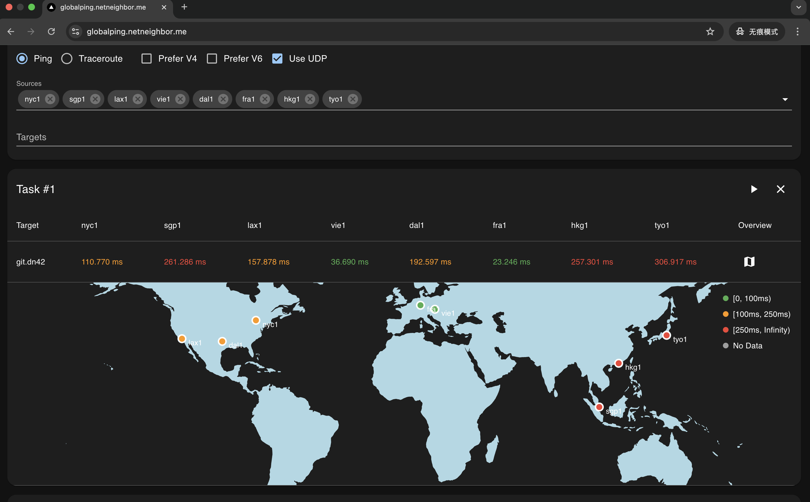

# MyGlobalping

MyGlobalping is not [globalping.io](https://globalping.io) (which is more famous and official), nor does it has anything to do with it.

MyGlobalping is a web-based ping & traceroute project, providing easy to use interface, helping users to have an intuitive view about miscellaneous network informations like how the IP packets get routed through or how well is the round-trip latency.

## Features

- Ping, Traceroute (UDP flavor or ICMP flavor)
- TCP Ping
- Basic DNS Probe
- DN42 Dual Stack support, Internet support
- Basic IP information display (like ASN, Country, and probably Lat Lon)
- API-first design, CLI friendly (can access through http clients like `curl`)
- Prometheus Metrics

## Build

If you are in a hurry, just go straight to try our deployed instance at [here](https://ping2.sh), or [here](http://ping.dn42)(DN42). Which is ready to use, and doesn't require you to build or install anything.

Make sure golang of newer version is already installed, if not, go visit [go.dev/doc/install](https://go.dev/doc/install) to download and un-tar a tarball, and make sure that $GOPATH/bin, and /usr/local/go/bin are in the $PATH.

Recursively clone the repo, cd into the project root, then

```shell
./buildversion.sh # to generate version metadata dependence
go build -o bin/globalping ./cmd/globalping
```

Now the binary `bin/globalping` can serve as an agent or a hub depending on the CLI arguments provided.

## Try or Debugging

After the binary is built, to see how it goes, try launch a testing purpose localhost agent:

```shell
scripts/launch_example_agent.sh
```

It binds on 127.0.0.1:8084, listens for plaintext HTTP requests, you can call the API with whaever HTTP client you like, for example:

```shell
curl --url-query destination=1.1.1.1 --url-query count=3 localhost:8084/simpleping
```

Doing so cause it send out 3 icmp echo request packets to the destination specified, 1.1.1.1, and the response will be stream to stdout in realtime in JSON line format.

It's better to use the web UI directly, since it has much richer feature set as well as easier to use UI.

## Screenshot

Currently the looking is still rugged, but we are actively iterating it.



## API Design

The agents respond to HTTP requests that have a path prefixed as `/simpleping`, and the hub responds to HTTP requests that have a path prefixed as `/ping`. Both HTTP request methods are GET, and port numbers are determined by command-line arguments. Parameters are encoded as URL search params.

Refer to [pkg/pinger/request.go](pkg/pinger/request.go) for what parameters are supported, and refer to [pkg/pinger/ping.go](pkg/pinger/ping.go) for the effects of the parameters.

Both `/simpleping` and `/ping` return a stream of JSON lines, so the line feed character can be used as the delimiter.

When sending requests to the hub, targets are encoded in `--url-query targets=` and separated by commas. When sending requests to the agent, only one target is supported at a time, and should be encoded in `--url-query destination`. The `--url-query` option is a syntax sugar provided by curl for easily encoding URL search params.

A client certificate pair is required for calling the agent's API endpoint, which is protected. Every request sent to it is authenticated via mTLS. Just refer to `bin/globalping agent --help` or `bin/globalping hub --help` for how to configure the certificates.

The APIs of the system are not intended to be called directly by end users; only developers should do that.

## Clustering

MyGlobalping system is designed to be distributed. There is a hub and many agents. The hub and agents communicate through mTLS-protected channels. An agent doesn't talk to other agents but only to the hub, and the hub only talks to agents. There is only one hub in a cluster.

Take a look at [docs/how-to-join.md](docs/how-to-join.md) for how to join a new agent to a cluster. It's no more complicated than just advertising itself to the hub.

## Todos

- Token-based Authentication
- Global-wide sending rate limit
