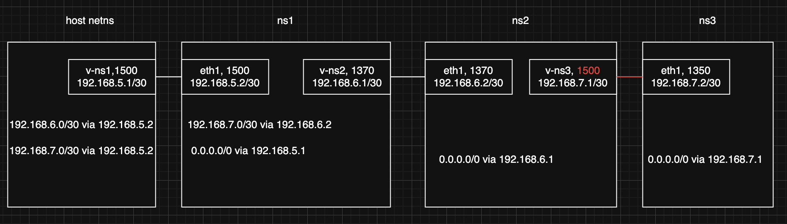

# How PMTU Works


Create the above lab environment using following commands, we use ns1, ns2, and ns3 for demonstrating purpose and it will delete them and re-create them, proceed with cautious:

## Build the Lab

```shell
# Delete namespaces if they already exist
ip netns del ns1 2>/dev/null
ip netns del ns2 2>/dev/null
ip netns del ns3 2>/dev/null
# Remove the interface belonging to the host netns if it exists
ip link del v-ns1 2>/dev/null

ip netns add ns1
ip netns add ns2
ip netns add ns3
# Note: The "host netns" is your current default networking stack.

for ns in ns1 ns2 ns3; do ip -n $ns l set lo up; done

ip l add v-ns1 type veth peer eth1 netns ns1
ip l add v-ns2 netns ns1 type veth peer eth1 netns ns2
ip l add v-ns3 netns ns2 type veth peer eth1 netns ns3

ip l set v-ns1 up
ip -n ns1 l set v-ns2 up
ip -n ns1 l set eth1 up
ip -n ns2 l set v-ns3 up
ip -n ns2 l set eth1 up
ip -n ns3 l set eth1 up

ip a add 192.168.5.1/30 dev v-ns1
ip -n ns1 a add 192.168.5.2/30 dev eth1
ip -n ns1 a add 192.168.6.1/30 dev v-ns2
ip -n ns2 a add 192.168.6.2/30 dev eth1
ip -n ns2 a add 192.168.7.1/30 dev v-ns3
ip -n ns3 a add 192.168.7.2/30 dev eth1

ip -n ns1 l set v-ns2 mtu 1370
ip -n ns2 l set eth1 mtu 1370
ip -n ns2 l set v-ns3 mtu 1350
ip -n ns3 l set eth1 mtu 1350

ip -n ns3 r add 0.0.0.0/0 via 192.168.7.1
ip -n ns2 r add 0.0.0.0/0 via 192.168.6.1
ip -n ns1 r add 0.0.0.0/0 via 192.168.5.1
ip -n ns1 r add 192.168.7.0/30 via 192.168.6.2
ip r add 192.168.6.0/30 via 192.168.5.2
ip r add 192.168.7.0/30 via 192.168.5.2

sysctl -w net.ipv4.conf.v-ns1.forwarding=1
ip netns exec ns1 sysctl -w net.ipv4.conf.eth1.forwarding=1
ip netns exec ns1 sysctl -w net.ipv4.conf.v-ns2.forwarding=1
ip netns exec ns2 sysctl -w net.ipv4.conf.eth1.forwarding=1
ip netns exec ns2 sysctl -w net.ipv4.conf.v-ns3.forwarding=1

ping -i 0.2 -c2 192.168.5.1
ping -i 0.2 -c2 192.168.5.2
ping -i 0.2 -c2 192.168.6.1
ping -i 0.2 -c2 192.168.6.2
ping -i 0.2 -c2 192.168.7.1
ping -i 0.2 -c2 192.168.7.2
```

## Probing Path MTU

### Probing Path MTU With Manual Approach

To start probing MTU, let's say the MTU for the nexthop interface is 1500, so, start with our probing mtu be 1500:

```shell
ping -c1 -s $((1500-8-20)) -4 -M do 192.168.7.2
```

We got this response:

```
PING 192.168.7.2 (192.168.7.2) 1472(1500) bytes of data.
From 192.168.5.2 icmp_seq=1 Frag needed and DF set (mtu = 1370)

--- 192.168.7.2 ping statistics ---
1 packets transmitted, 0 received, +1 errors, 100% packet loss, time 0ms
```

So, adjust the probing mtu to 1370 and go ahead:

```shell
ping -c1 -s $((1370-8-20)) -4 -M do 192.168.7.2
```

Then we got this response:

```
PING 192.168.7.2 (192.168.7.2) 1342(1370) bytes of data.
From 192.168.6.2 icmp_seq=1 Frag needed and DF set (mtu = 1350)

--- 192.168.7.2 ping statistics ---
1 packets transmitted, 0 received, +1 errors, 100% packet loss, time 0ms
```

Adjust the probing mtu to 1350 and go ahead:

```shell
ping -c1 -s $((1350-8-20)) -4 -M do 192.168.7.2
```

Finally we reach the target:

```
PING 192.168.7.2 (192.168.7.2) 1322(1350) bytes of data.
1330 bytes from 192.168.7.2: icmp_seq=1 ttl=62 time=0.171 ms

--- 192.168.7.2 ping statistics ---
1 packets transmitted, 1 received, 0% packet loss, time 0ms
rtt min/avg/max/mdev = 0.171/0.171/0.171/0.000 ms
```

### Probing With Automatic Approach

With command:

```shell
traceroute --mtu 192.168.7.2
## or tracepath -n 192.168.7.2  # depending on what is installed
```

You get this output:

```
traceroute to 192.168.7.2 (192.168.7.2), 30 hops max, 65000 byte packets
 1  192.168.5.2 (192.168.5.2)  0.088 ms F=1500  0.074 ms  0.015 ms
 2  192.168.6.2 (192.168.6.2)  0.030 ms F=1370  0.093 ms  0.026 ms
 3  192.168.7.2 (192.168.7.2)  0.030 ms F=1350  0.101 ms  0.051 ms
```

### Kernel's PMTU Cache

Once the Path MTU is probed, the kernel might cache the PMTU result for you, you can then adjust the mtu of the nexthop interface(s) accordingly:

```
ip r get 192.168.7.2
192.168.7.2 via 192.168.5.2 dev v-ns1 src 192.168.5.1 uid 0
    cache expires 381sec mtu 1350
```

Once you decided to ajust the MTU setting of some interface, **make sure all interface MTUs in the point-to-point link (or in the same LAN) are strictly aligned**, in our example, if you changed the MTU of v-ns1 to 1350, then you also have to change the MTU of eth1 in ns2 to 1350 so that they align.

## When PMTU Doesn't Work

There are many events that can cause normal PMTU discovery be failed, notably, some misconfigured firwalls, routers or gateways might drop ICMP messages for reasons we do or do not know, hence breaks PMTU discovery.

Beside that, in order to make the entire network functioning properly, for each link, **the MTU must match on both ends**, otherwise, normal PMTU probing might not works as expected. Look at the following topology diagram:



As we saw, the MTU of v-ns3 interface in ns2 has been intentionally adjusted to 1500, which is appearently higher than the MTU of its interface that connects ns1, and most importantly, mis-aligned with the MTU of another end of the point-to-point link which is 1350.

Let's take a look at traceroute to see if it's still functioning properly:

```
traceroute --mtu 192.168.7.2
traceroute to 192.168.7.2 (192.168.7.2), 30 hops max, 65000 byte packets
 1  192.168.5.2 (192.168.5.2)  0.077 ms F=1500  0.070 ms  0.017 ms
 2  192.168.6.2 (192.168.6.2)  0.036 ms F=1370  0.142 ms  0.054 ms
 3  * * *
 4  * * *
 5  * * *
 6  * *^C
```

Well, the traceroute just stucks here. Clearly, MTU mismatch is likely causing automatic PMTU discovery be broken.

In our case, this is because that the ns2 router thinks that, MTU 1370 is already small enough to let the packet get pass through v-ns3 (which has a MTU of 1500) to reach the nexthop, everything seems alright because 1370 < 1500, except that ns2 has no knowledge of the MTU of the peer side and never knows that 1500 MTU of v-ns3 is actually wrong (because mismatch).

To repair this, re-pair the mismatch MTU setting of v-ns3 with it's peer (eth1 in ns3, MTU 1350)

```shell
ip -n ns2 l set v-ns3 mtu 1350
traceroute --mtu 192.168.7.2
traceroute to 192.168.7.2 (192.168.7.2), 30 hops max, 65000 byte packets
 1  192.168.5.2 (192.168.5.2)  0.092 ms F=1500  0.076 ms  0.022 ms
 2  192.168.6.2 (192.168.6.2)  0.040 ms F=1370  0.109 ms  0.023 ms
 3  192.168.7.2 (192.168.7.2)  0.037 ms F=1350  0.108 ms  0.028 ms
```

Since the MTUs are now matched, automatic PMTU discovery works again.

## Clean Up

```shell
ip netns del ns1
ip netns del ns2
ip netns del ns3
```
